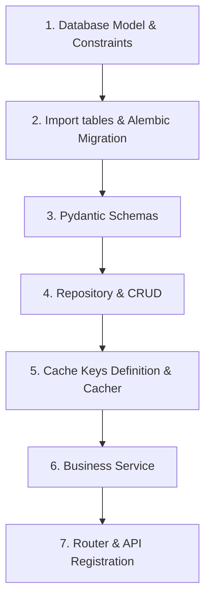

# FastAPI Project Template - Clean Architecture

This project serves as a starting structure (boilerplate/template) for developing resilient, high-performance, and scalable web applications and REST APIs with FastAPI. It implements a strict separation of responsibilities (Clean Architecture) and rigorous typing at all levels.

---

> **🌍 Documentation Available in Other Languages**
> - [Français (French)](./README_fr.md)

---

## 1. Detailed Documentation Index

To deeply understand the different components of the application and recommended patterns, please refer to the following documents:

- [📂 Architecture Overview & Data Flow - EN](file:///home/sevtify/Projets/fast-api-project-template/app/docs/architecture_overview_en.md) / [FR](file:///home/sevtify/Projets/fast-api-project-template/app/docs/architecture_overview_fr.md) : Conceptual model (Router ➔ Service ➔ Repository ➔ Cache) and lifecycle.
- [📂 Database & Models - EN](file:///home/sevtify/Projets/fast-api-project-template/app/docs/database_and_models_en.md) / [FR](file:///home/sevtify/Projets/fast-api-project-template/app/docs/database_and_models_fr.md) : SQLAlchemy 2.0, `IntegrityMapperMixin` mixin, and constraint management.
- [📂 Results & Errors Management - EN](file:///home/sevtify/Projets/fast-api-project-template/app/docs/results_and_errors_en.md) / [FR](file:///home/sevtify/Projets/fast-api-project-template/app/docs/results_and_errors_fr.md) : `GenericAppResult` return model and subclasses (`CrudResult`, `ServiceResult`, `IntegrationServiceResult`).
- [📂 Cache System - EN](file:///home/sevtify/Projets/fast-api-project-template/app/docs/caching_system_en.md) / [FR](file:///home/sevtify/Projets/fast-api-project-template/app/docs/caching_system_fr.md) : Type-safe Redis cache registration and usage via Factory.
- [📂 Authentication & Security (RBAC) - EN](file:///home/sevtify/Projets/fast-api-project-template/app/docs/auth_and_security_en.md) / [FR](file:///home/sevtify/Projets/fast-api-project-template/app/docs/auth_and_security_fr.md) : Dual cookie (Access/Refresh), `HttpOnly` authentication, and role dependencies.
- [📂 Repositories & Services - EN](file:///home/sevtify/Projets/fast-api-project-template/app/docs/repositories_and_services_en.md) / [FR](file:///home/sevtify/Projets/fast-api-project-template/app/docs/repositories_and_services_fr.md) : Data and business logic modules writing and structuring.
- [📂 API Routers & Middlewares - EN](file:///home/sevtify/Projets/fast-api-project-template/app/docs/routers_and_schemas_en.md) / [FR](file:///home/sevtify/Projets/fast-api-project-template/app/docs/routers_and_schemas_fr.md) : Premium Swagger configuration, Pydantic validation, and diagnostic middlewares.

---

## 2. Development Workflow (Adding a Feature)

When adding a new entity to the application (e.g., a `Product`), you must follow this step-by-step cycle to respect the template paradigm:



### Step 1: Create the Database Model
Create the model file in `app/db/models/product.py`.
- Inherit from `Base` (which integrates `MappedAsDataclass`) and `IntegrityMapperMixin`.
- Define all table constraints (uniques, foreign keys, checks) as explicit constants at the top of the file.
- Fill in the `ERROR_MESSAGES` dictionary mapping SQL constraints to user error messages.
- For automatic columns (ID, timestamps, relationships), use `init=False`.

### Step 2: Declare the Table & Generate Migration
1. Import your model within the `add_all_tables()` function in [app/db/__init__.py](file:///home/sevtify/Projets/fast-api-project-template/app/db/__init__.py) so Alembic can detect it:
   ```python
   def add_all_tables():
       from app.db.models.user import User
       from app.db.models.session import Session
       from app.db.models.product import Product  # <-- IMPORT
   ```
2. Generate the SQL migration file:
   ```bash
   alembic revision --autogenerate -m "Create product table"
   ```
3. Apply the migration to your local database:
   ```bash
   alembic upgrade head
   ```

### Step 3: Define Pydantic Schemas
In the `app/schemas/` folder, create `product_schemas.py`:
- Create request schemas (e.g., `CreateProduct`, `UpdateProduct`).
- Create the typed output schema (e.g., `ReadProduct` with `from_attributes = True`).
- Create the API response wrapper by inheriting from `DefaultAppApiResponse` (e.g., `ProductInfos(DefaultAppApiResponse[ReadProduct])`) for premium Swagger documentation.

### Step 4: Develop the Repository
Create the repository file in `app/repositories/product_repository.py`.
- Declare a class decorated with `@dataclass` receiving `db: AsyncSession`.
- Implement CRUD methods by wrapping queries in a `try/except` block.
- Intercept errors by redirecting exceptions to `RepositoriesUtils.traiter_errors_en_global` passing the entity model.
- Always return a `CrudResult` object (or `DefaultAppCrudResult`).

### Step 5: Configure Cache
1. Define the cache key pattern in `BaseCacheEntity` and `AvailableCacheKeys` (in [app/cache/helpers/availables.py](file:///home/sevtify/Projets/fast-api-project-template/app/cache/helpers/availables.py)).
2. Declare the key in `CacheKeysFactory` (in [app/cache/helpers/keys_factory.py](file:///home/sevtify/Projets/fast-api-project-template/app/cache/helpers/keys_factory.py)) with its number of placeholders.
3. Create a dedicated cache class `ProductCache` in `app/cache/product_cache.py` to isolate Redis accesses.

### Step 6: Code the Business Service
Create the service file in `app/services/product_service.py`.
- Take `db: AsyncSession` and `cache: CacheWrapper` in the `__init__` constructor.
- Internally instantiate `ProductRepository` and `ProductCache`.
- Implement business logic: read cache first, query repository on cache-miss, save read data in cache, and return a `ServiceResult` (or `DefaultAppServiceResult`).
- Propagate repository failures to the service via `repo_res.to_service_error(service_name=self._service_name)`.

### Step 7: Create and Register the API Router
Create the router file in `app/routers/v1/product_router.py`.
- Create the `APIRouter` instance with appropriate tags.
- Inject the service with `Depends(get_product_service)`.
- Set the route's `response_model` to your concrete wrapper (e.g., `response_model=ProductInfos`).
- Specify the return annotation `-> ApiBaseResponse[ReadProduct, AppError]`.
- Register the new router in the main router [app/routers/v1/base_router.py](file:///home/sevtify/Projets/fast-api-project-template/app/routers/v1/base_router.py) via `v1_api_router.include_router(product_router)`.

---

## 3. Running the Project Locally

### Prerequisites
- Python 3.11+
- PostgreSQL database (or Dockerized)
- Redis (for cache and Celery)

### Quick Start

1. **Clone the project and prepare the environment**:
   ```bash
   python -m venv .venv
   source .venv/bin/activate
   pip install -r requirements.txt
   ```
2. **Configure environment variables**:
   Copy the `.env.example` file to `.env` and adjust the PostgreSQL and Redis access parameters.
3. **Run database migrations**:
   ```bash
   alembic upgrade head
   ```
4. **Start the development server**:
   ```bash
   # Uses uvicorn under the hood to run the application on the configured port
   python app/main.py
   ```
5. **Access API documentation**:
   Open your browser to [http://localhost:8000/docs](http://localhost:8000/docs) to view the interactive Swagger.

### Starting Celery Workers (Background Tasks)
If your project uses Celery for asynchronous processing, start the Celery worker from the project root:
```bash
celery -A app.worker.celery_app worker --loglevel=info
```

---

## 📚 Documentation Language Notes

All documentation files in the `app/docs/` directory are available in both **English** and **French**:
- English versions have the `_en.md` suffix
- French versions have the `_fr.md` suffix

Each documentation file contains a notice at the top indicating the availability of the other language version.
