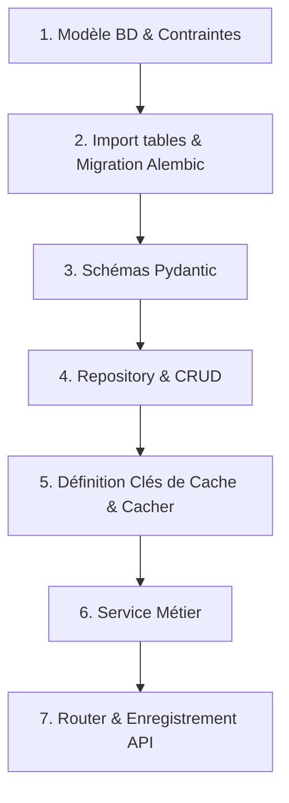

# Template Projet FastAPI - Clean Architecture

Ce projet sert de structure de départ (boiler-plate/template) pour le développement d'applications web et d'API REST résilientes, performantes et scalables avec FastAPI. Il met en application une séparation stricte des responsabilités (Clean Architecture) et un typage rigoureux à tous les niveaux.

---

> **🌍 Documentation Available in Other Languages**
> - [English (Anglais)](./README.md)

---

## 1. Index de la Documentation Détaillée

Pour comprendre en profondeur les différents composants de l'application et les patterns recommandés, veuillez consulter les documents suivants :

- [📂 Aperçu de l'Architecture & Flux de Données](./docs/architecture_overview_fr.md) : Modèle conceptuel (Router ➔ Service ➔ Repository ➔ Cache) et cycle de vie.
- [📂 Modèles & Base de Données](./docs/database_and_models_fr.md) : SQLAlchemy 2.0, mixin `IntegrityMapperMixin` et gestion des contraintes.
- [📂 Gestion des Résultats & Erreurs](./docs/results_and_errors_fr.md) : Modèle de retour `GenericAppResult` et sous-classes (`CrudResult`, `ServiceResult`, `IntegrationServiceResult`).
- [📂 Système de Cache](./docs/caching_system_fr.md) : Enregistrement et utilisation type-safe du cache Redis via la Factory.
- [📂 Authentification & Sécurité (RBAC)](./docs/auth_and_security_fr.md) : Double cookie (Access/Refresh), authentification `HttpOnly` et dépendances de rôles.
- [📂 Repositories & Services](./docs/repositories_and_services_fr.md) : Écriture et structuration des modules de données et de logique métier.
- [📂 API Routers & Middlewares](./docs/routers_and_schemas_fr.md) : Configuration Swagger Premium, validation Pydantic et middlewares de diagnostic.

---

## 2. Workflow de Développement (Ajout d'une fonctionnalité)

Lors de l'ajout d'une nouvelle entité dans l'application (ex: un produit `Product`), vous devez suivre ce cycle étape par étape pour respecter le paradigme du template :



### Étape 1 : Créer le Modèle de Base de Données
Créez le fichier de modèle dans `app/db/models/product.py`. 
- Héritez de `Base` (qui intègre `MappedAsDataclass`) et de `IntegrityMapperMixin`.
- Définissez toutes les contraintes de table (uniques, clés étrangères, checks) sous forme de constantes explicites en haut du fichier.
- Renseignez le dictionnaire `ERROR_MESSAGES` mappant les contraintes SQL aux messages d'erreur utilisateurs.
- Pour les colonnes automatiques (ID, timestamps, relations), utilisez `init=False`.

### Étape 2 : Déclarer la Table & Générer la Migration
1. Importez votre modèle au sein de la fonction `add_all_tables()` dans [app/db/__init__.py](file:///home/sevtify/Projets/fast-api-project-template/app/db/__init__.py) pour qu'Alembic puisse le détecter :
   ```python
   def add_all_tables():
       from app.db.models.user import User
       from app.db.models.session import Session
       from app.db.models.product import Product  # <-- IMPORT
   ```
2. Générez le fichier de migration SQL :
   ```bash
   alembic revision --autogenerate -m "Create product table"
   ```
3. Appliquez la migration sur votre base de données locale :
   ```bash
   alembic upgrade head
   ```

### Étape 3 : Définir les Schémas Pydantic
Dans le dossier `app/schemas/`, créez `product_schemas.py` :
- Créez les schémas de requêtes (ex: `CreateProduct`, `UpdateProduct`).
- Créez le schéma de sortie typé (ex: `ReadProduct` avec `from_attributes = True`).
- Créez l'enveloppe de réponse API en héritant de `DefaultAppApiResponse` (ex: `ProductInfos(DefaultAppApiResponse[ReadProduct])`) pour générer une documentation Swagger premium.

### Étape 4 : Développer le Repository
Créez le fichier de repository dans `app/repositories/product_repository.py`.
- Déclarez une classe décorée de `@dataclass` recevant `db: AsyncSession`.
- Implémentez les méthodes CRUD en enveloppant les requêtes dans un bloc `try/except`.
- Interceptez les erreurs en redirigeant les exceptions vers `RepositoriesUtils.traiter_errors_en_global` en lui passant le modèle de l'entité.
- Retournez toujours un objet `CrudResult` (ou `DefaultAppCrudResult`).

### Étape 5 : Configurer le Cache
1. Définissez le motif de clé de cache dans `BaseCacheEntity` et `AvailableCacheKeys` (dans [app/cache/helpers/availables.py](file:///home/sevtify/Projets/fast-api-project-template/app/cache/helpers/availables.py)).
2. Déclarez la clé dans `CacheKeysFactory` (dans [app/cache/helpers/keys_factory.py](file:///home/sevtify/Projets/fast-api-project-template/app/cache/helpers/keys_factory.py)) avec son nombre de placeholders.
3. Créez une classe de cache dédiée `ProductCache` dans `app/cache/product_cache.py` pour isoler les accès Redis.

### Étape 6 : Coder le Service Métier
Créez le fichier de service dans `app/services/product_service.py`.
- Prenez `db: AsyncSession` et `cache: CacheWrapper` dans le constructeur `__init__`.
- Instanciez de manière interne `ProductRepository` et `ProductCache`.
- Implémentez la logique métier : lisez le cache d'abord, interrogez le repository en cas de cache-miss, enregistrez la donnée lue dans le cache, et retournez un `ServiceResult` (ou `DefaultAppServiceResult`).
- Propager les échecs du repository au service via `repo_res.to_service_error(service_name=self._service_name)`.

### Étape 7 : Créer et Enregistrer le Router API
Créez le fichier de routeur dans `app/routers/v1/product_router.py`.
- Créez l'instance `APIRouter` avec les tags appropriés.
- Injectez le service avec `Depends(get_product_service)`.
- Configurez `response_model` de la route sur votre enveloppe concrète (ex: `response_model=ProductInfos`).
- Spécifiez l'annotation de retour `-> ApiBaseResponse[ReadProduct, AppError]`.
- Enregistrez le nouveau routeur dans le routeur principal [app/routers/v1/base_router.py](file:///home/sevtify/Projets/fast-api-project-template/app/routers/v1/base_router.py) via `v1_api_router.include_router(product_router)`.

---

## 3. Lancement du Projet en Local

### Prérequis
- Python 3.11+
- Base de données PostgreSQL (ou dockerisée)
- Redis (pour le cache et Celery)

### Démarrage Rapide

1. **Cloner le projet et préparer l'environnement** :
   ```bash
   python -m venv .venv
   source .venv/bin/activate
   pip install -r requirements.txt
   ```
2. **Configurer les variables d'environnement** :
   Copiez le fichier `.env.example` vers `.env` et ajustez les paramètres d'accès à PostgreSQL et Redis.
3. **Lancer les migrations de base de données** :
   ```bash
   alembic upgrade head
   ```
4. **Lancer le serveur de développement** :
   ```bash
   # Utilise uvicorn sous le capot pour exécuter l'application sur le port configuré
   python app/main.py
   ```
5. **Accéder à la documentation API** :
   Ouvrez votre navigateur sur [http://localhost:8000/docs](http://localhost:8000/docs) pour visualiser le Swagger interactif.

### Démarrage des Workers Celery (Tâches en arrière-plan)
Si votre projet utilise Celery pour des traitements asynchrones, lancez le worker Celery depuis la racine du projet :
```bash
celery -A app.worker.celery_app worker --loglevel=info
```

---

## 📚 Notes sur les Langues de Documentation

Tous les fichiers de documentation dans le dossier `docs/` sont disponibles en **français** et en **anglais** :
- Les versions anglaises ont le suffixe `_en.md`
- Les versions françaises ont le suffixe `_fr.md`

Chaque fichier de documentation contient une notice en haut indiquant la disponibilité de l'autre version linguistique.
