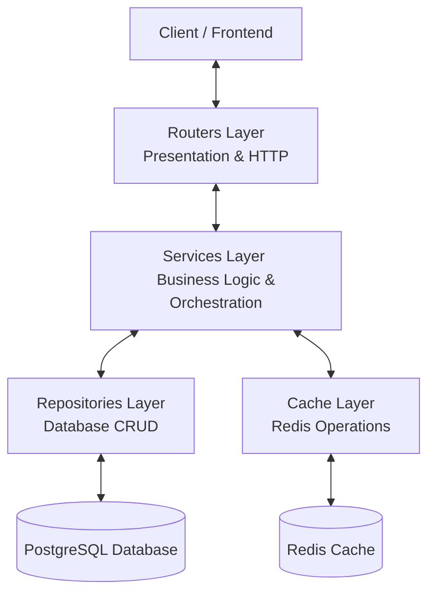

# Architecture Overview & Data Flow

This document describes the architectural choices, overall vision, and data flow paradigm within the template project.

---

> **📄 Documentation Available in French**
> A French version of this document is available: [architecture_overview_fr.md](./architecture_overview_fr.md)

---

## 1. Global Vision and Paradigm

The template project is based on a **layered architecture** (n-tier) guided by **Clean Code** principles and a **strict separation of responsibilities**.

The main objective is to prevent any logic contamination between layers:
- **Routers** (HTTP) should never directly access the database or cache. They delegate everything to **Services**.
- **Services** (Business Logic) orchestrate the overall business logic, manage logical transactions, coordinate cache, and call **Repositories**. They should not handle HTTP requests or generate direct HTTP responses (they return `ServiceResult`).
- **Repositories** (Data) exclusively execute SQL queries via SQLAlchemy. They are unaware of HTTP requests or complex business logic.
- **Cache** (Optimization) encapsulates all Redis operations through dedicated cache classes.

---

## 2. Layer Roles and Responsibilities

### 2.1. Presentation Layer (Routers / API)
- **Role**: Define HTTP routes, validate incoming parameters (via Pydantic schemas), and serialize outputs.
- **Location**: [app/routers/](../app/routers)
- **Rules**:
  - Use FastAPI dependencies (`Depends`) to inject services.
  - Validate outputs with the `response_model` parameter set to an explicit subclass of `ApiBaseResponse` (for clean Swagger documentation).
  - Translate the service result into an HTTP response via `service_res.to_HTTP_api_base_response(response)`.

### 2.2. Business Layer (Services)
- **Role**: Contain the application's intelligence (business validation, calculations, flow orchestration).
- **Location**: [app/services/](../app/services)
- **Rules**:
  - Receive dependencies (`db: AsyncSession`, `cache: CacheWrapper`) via constructor (`__init__`).
  - Internally instantiate repositories and cache classes as needed.
  - **Always** return a `ServiceResult[D, E]` (or `DefaultAppServiceResult[D]`), encapsulating business success or failure with an appropriate HTTP code.

### 2.3. Data Access Layer (Repositories)
- **Role**: Translate data queries into async SQLAlchemy queries.
- **Location**: [app/repositories/](../app/repositories)
- **Rules**:
  - Decorated with `@dataclass` to simplify the injection of the database session `db: AsyncSession`.
  - Handle exceptions globally via the `RepositoriesUtils` helper (`traiter_errors_en_global` or `traiter_exception_inconnue`).
  - **Always** return a `CrudResult[D, E]` (or `DefaultAppCrudResult[D]`).

### 2.4. Cache Layer (Cachers)
- **Role**: Provide a type-safe interface for storing and invalidating frequently read entities.
- **Location**: [app/cache/](../app/cache)
- **Rules**:
  - Encapsulate the low-level Redis wrapper (`CacheWrapper`).
  - Use structured and centrally registered cache keys (`CacheKey`, `AvailableCacheKeys`, `CacheKeysFactory`).

---

## 3. Application Lifecycle and Startup

The application startup is orchestrated in [app/settings/app_lifespan.py](../app/settings/app_lifespan.py):
1. **uvloop**: Used to optimize the asyncio event loop on Unix systems (configured in [app/main.py](../app/main.py)). A standard async fallback is provided for Windows.
2. **Setup Logging**: Loading the log configuration.
3. **Dependency Health Check**: Async parallel execution of `SELECT 1` on the database and `ping` on Redis (with a strict 5-second timeout) to block or warn if a critical dependency is unavailable at startup.
