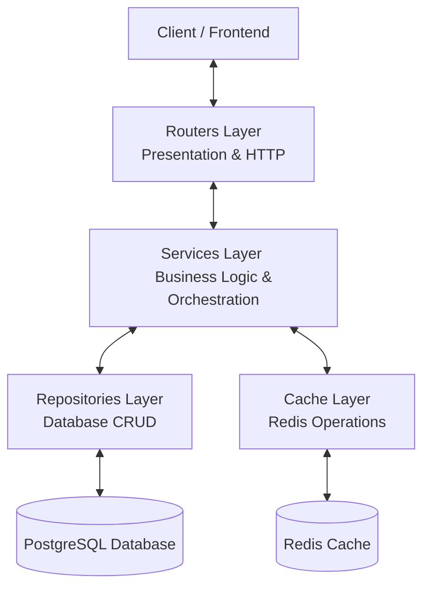

# Aperçu de l'Architecture & Flux de Données

Ce document décrit les choix d'architecture, la vision globale et le paradigme de flux de données au sein du projet template.

---

> **📄 Documentation Available in English**
> An English version of this document is available: [architecture_overview_en.md](./architecture_overview_en.md)

---

## 1. Vision et Paradigme Global
Le projet template est basé sur une **architecture en couches** (n-tier) guidée par des principes de **Clean Code** et une **séparation stricte des responsabilités**. 

L'objectif majeur est d'éviter toute contamination de logique entre les couches :
- Les **Routers** (HTTP) ne doivent jamais toucher à la base de données ou au cache directement. Ils délèguent tout aux **Services**.
- Les **Services** (Métier) orchestrent la logique métier globale, gèrent les transactions logiques, coordonnent le cache et appellent les **Repositories**. Ils ne doivent pas manipuler de requêtes HTTP ni générer de réponses HTTP directes (ils renvoient des `ServiceResult`).
- Les **Repositories** (Données) effectuent exclusivement les requêtes SQL via SQLAlchemy. Ils ne connaissent pas la notion de requêtes HTTP ni de logique métier complexe.
- Le **Cache** (Optimisation) encapsule toutes les opérations Redis via des classes de cache dédiées.

---

## 2. Rôles et Responsabilités des Couches

### 2.1. Couche Présentation (Routers / API)
- **Rôle** : Définir les routes HTTP, valider les paramètres entrants (via les schémas Pydantic) et sérialiser les sorties.
- **Emplacement** : [app/routers/](../app/routers)
- **Règles** :
  - Utilise les dépendances FastAPI (`Depends`) pour injecter les services.
  - Valide les sorties avec le paramètre `response_model` réglé sur une sous-classe explicite de `ApiBaseResponse` (pour une documentation Swagger propre).
  - Traduit le résultat du service en réponse HTTP via `service_res.to_HTTP_api_base_response(response)`.

### 2.2. Couche Métier (Services)
- **Rôle** : Contenir l'intelligence de l'application (validation métier, calculs, orchestration des flux).
- **Emplacement** : [app/services/](../app/services)
- **Règles** :
  - Reçoit ses dépendances (`db: AsyncSession`, `cache: CacheWrapper`) via son constructeur (`__init__`).
  - Instancie en interne les repositories et les classes de cache nécessaires.
  - Retourne **toujours** un objet `ServiceResult[D, E]` (ou `DefaultAppServiceResult[D]`), encapsulant le succès ou l'échec métier avec un code HTTP approprié.

### 2.3. Couche Accès Données (Repositories)
- **Rôle** : Traduire les requêtes de données en requêtes SQL asynchrones SQLAlchemy.
- **Emplacement** : [app/repositories/](../app/repositories)
- **Règles** :
  - Décoré avec `@dataclass` pour simplifier l'injection de la session BD `db: AsyncSession`.
  - Gère les exceptions de manière globale via le helper `RepositoriesUtils` (`traiter_errors_en_global` ou `traiter_exception_inconnue`).
  - Retourne **toujours** un objet `CrudResult[D, E]` (ou `DefaultAppCrudResult[D]`).

### 2.4. Couche Cache (Cachers)
- **Rôle** : Offrir une interface type-safe pour stocker et invalider les entités fréquemment lues.
- **Emplacement** : [app/cache/](../app/cache)
- **Règles** :
  - Encapsule le wrapper Redis de bas niveau (`CacheWrapper`).
  - Utilise des clés de cache structurées et enregistrées centralement (`CacheKey`, `AvailableCacheKeys`, `CacheKeysFactory`).

---

## 3. Cycle de vie et démarrage de l'application
Le démarrage de l'application est orchestré dans [app/settings/app_lifespan.py](../app/settings/app_lifespan.py) :
1. **uvloop** : Utilisé pour optimiser l'event loop d'asyncio sur les systèmes Unix (configuré dans [app/main.py](../app/main.py)). Un fallback asynchrone standard est prévu pour Windows.
2. **Setup Logging** : Chargement de la configuration des logs.
3. **Health Check des dépendances** : Exécution asynchrone en parallèle de `SELECT 1` sur la base de données et `ping` sur Redis (avec un timeout strict de 5 secondes) pour bloquer ou avertir si une dépendance critique est indisponible au démarrage.
