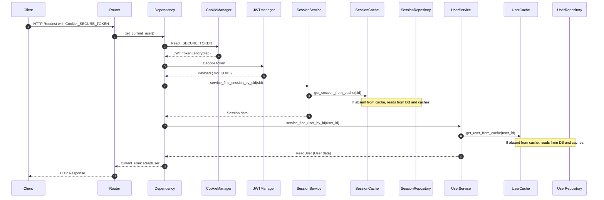

# Authentication, Secure Cookies & Role-Based Access Control (RBAC)

This document describes the security system, dual-cookie authentication, and role-based access restrictions.

---

> **📄 Documentation Available in French**
> A French version of this document is available: [auth_and_security_fr.md](./auth_and_security_fr.md)

---

## 1. Dual Cookie Strategy (Access & Refresh)

To maximize security while providing a smooth user experience, the template uses two distinct securely stored client-side cookies:

1. **Access Token**:
   - **Cookie Name**: `_SECURE_TOKEN` (defined by `JWT_COOKIE_ACCESS_ID` in [app/core/config.py](../app/core/config.py)).
   - **Duration**: Short (1 hour by default).
   - **Role**: Used to authenticate each direct HTTP request. Contains the encrypted session ID (`sid`) in the payload.
2. **Refresh Token**:
   - **Cookie Name**: `_SID_REFRESH` (defined by `SID_REF_COOKIE` in [app/core/config.py](../app/core/config.py)).
   - **Duration**: Long (7 days by default).
   - **Role**: Used only to renew the expired Access Token via the `/auth/refresh` route. Contains the session ID (`sid`) and the refresh token hash.

### 1.1. Cookie Security
The [CookieManager](../app/auth/cookie_manager.py) class manages cookie deposit, reading, and deletion:
- **HttpOnly=True**: Blocks JavaScript access to cookies, preventing XSS attacks.
- **Secure**: Forced to `True` in `PRODUCTION` environment (transmitted only via HTTPS).
- **SameSite**: Set to `"lax"` in local development for easier debugging and `"none"` in production to allow secure cross-origin requests.

---

## 2. Authentication Cycle



### 2.1. Main Dependency
To protect an endpoint and get the logged-in user, use the injected dependency `get_current_user` from [app/auth/dependencies.py](../app/auth/dependencies.py):

```python
from fastapi import APIRouter, Depends
from app.auth.dependencies import get_current_user
from app.schemas.user_schemas import ReadUser

router = APIRouter()

@router.get("/protected")
async def my_protected_endpoint(
    current_user: ReadUser = Depends(get_current_user)
):
    return {"message": f"Hello {current_user.username}"}
```

---

## 3. Role-Based Access Control (RBAC)

Access control relies on the [RoleChecker](../app/auth/role_checker.py) class, which verifies the user's role returned by `get_current_user`.

To avoid instantiating role checkers for each route, preconfigured dependencies are centralized in the [RoleDepends](../app/auth/role_depends.py) class:
- `RoleDepends.all_authorize`: Allows users of type `ADMIN` and `USER`.
- `RoleDepends.only_admin_authorize`: Exclusive access restriction for `ADMIN` role.

### Example of usage on an admin route:
```python
from fastapi import APIRouter, Depends
from app.auth.role_depends import RoleDepends
from app.schemas.user_schemas import ReadUser

router = APIRouter(prefix="/admin")

@router.post("/dashboard", dependencies=[Depends(RoleDepends.only_admin_authorize)])
async def admin_dashboard():
    """Only ADMIN users can execute this route."""
    return {"status": "Welcome to the admin dashboard"}
```

> [!TIP]
> If you need to retrieve the logged-in user's data while validating their role, you can directly inject `RoleDepends` into your function signature:
> ```python
> @router.get("/profile")
> async def user_profile(
>     current_user: ReadUser = Depends(RoleDepends.all_authorize)
> ):
>     return {"profile": current_user}
> ```
