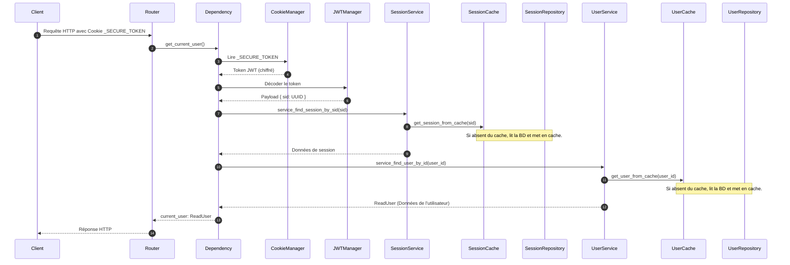

# Authentification, Cookies Sécurisés & Gestion des Rôles (RBAC)

Ce document décrit le fonctionnement du système de sécurité, l'authentification à double cookie et la restriction d'accès basée sur les rôles.

---

> **📄 Documentation Available in English**
> An English version of this document is available: [auth_and_security_en.md](./auth_and_security_en.md)

---

## 1. Stratégie à Double Cookie (Access & Refresh)

Pour maximiser la sécurité tout en offrant une expérience utilisateur fluide, le template utilise deux cookies distincts stockés de manière sécurisée côté client :

1. **Access Token** : 
   - **Nom de cookie** : `_SECURE_TOKEN` (défini par `JWT_COOKIE_ACCESS_ID` dans [app/core/config.py](../app/core/config.py)).
   - **Durée** : Courte (1 heure par défaut).
   - **Rôle** : Utilisé pour authentifier chaque requête HTTP directe. Contient l'ID de session (`sid`) chiffré dans le payload.
2. **Refresh Token** :
   - **Nom de cookie** : `_SID_REFRESH` (défini par `SID_REF_COOKIE` dans [app/core/config.py](../app/core/config.py)).
   - **Durée** : Longue (7 jours par défaut).
   - **Rôle** : Utilisé uniquement pour renouveler l'Access Token expiré via la route `/auth/refresh`. Contient l'ID de la session (`sid`) et le hash du refresh token.

### 1.1. Sécurisation des Cookies
La classe [CookieManager](../app/auth/cookie_manager.py) gère le dépôt, la lecture et la suppression des cookies :
- **HttpOnly=True** : Bloque l'accès aux cookies via JavaScript, empêchant les attaques XSS.
- **Secure** : Forcé à `True` en environnement `PRODUCTION` (transmis uniquement via HTTPS).
- **SameSite** : Réglé sur `"lax"` en local pour faciliter le développement et `"none"` en production pour autoriser les requêtes cross-origin sécurisées.

---

## 2. Cycle d'Authentification



### 2.1. Dépendance Principale
Pour protéger un endpoint et obtenir l'utilisateur connecté, utilisez la dépendance injectée `get_current_user` issue de [app/auth/dependencies.py](../app/auth/dependencies.py) :

```python
from fastapi import APIRouter, Depends
from app.auth.dependencies import get_current_user
from app.schemas.user_schemas import ReadUser

router = APIRouter()

@router.get("/protected")
async def mon_endpoint_protege(
    current_user: ReadUser = Depends(get_current_user)
):
    return {"message": f"Bonjour {current_user.username}"}
```

---

## 3. Contrôle d'Accès par Rôle (RBAC)

Le contrôle d'accès repose sur la classe [RoleChecker](../app/auth/role_checker.py), qui vérifie le rôle de l'utilisateur retourné par `get_current_user`.

Pour éviter d'instancier des vérificateurs de rôles à chaque route, des dépendances préconfigurées sont centralisées dans la classe [RoleDepends](../app/auth/role_depends.py) :
- `RoleDepends.all_authorize` : Autorise les utilisateurs de type `ADMIN` et `USER`.
- `RoleDepends.only_admin_authorize` : Restriction d'accès exclusive au rôle `ADMIN`.

### Exemple d'utilisation sur une route d'administration :
```python
from fastapi import APIRouter, Depends
from app.auth.role_depends import RoleDepends
from app.schemas.user_schemas import ReadUser

router = APIRouter(prefix="/admin")

@router.post("/dashboard", dependencies=[Depends(RoleDepends.only_admin_authorize)])
async def admin_dashboard():
    """Seuls les utilisateurs ADMIN peuvent exécuter cette route."""
    return {"status": "Welcome to the admin dashboard"}
```
> [!TIP]
> Si vous avez besoin de récupérer les données de l'utilisateur connecté tout en validant son rôle, vous pouvez directement injecter `RoleDepends` dans la signature de votre fonction :
> ```python
> @router.get("/profile")
> async def user_profile(
>     current_user: ReadUser = Depends(RoleDepends.all_authorize)
> ):
>     return {"profile": current_user}
> ```
